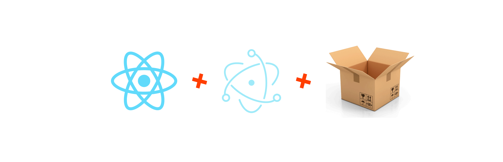
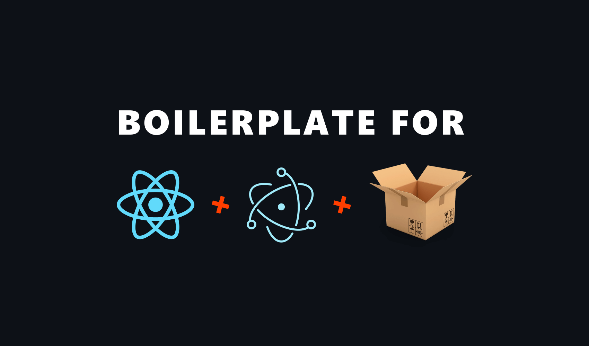

<h1 align="center">
    
</h1>

A minimal boilerplate for [React](https://reactjs.org/) + [Electron](http://electronjs.org/), built with [Parcel](https://parceljs.org/). 📦🚀

## 🏃‍♂️ Getting Started

Run the following commands to start the project:

- `git clone https://github.com/flowforfrank/react-electron-parcel-boilerplate.git`
- `npm i`
- `npm run start`

*The `electron` command in the `package.json` file is only used internally by the boilerplate to launch electron.*

## 🏗️ How to Build the Project

Run `npm run build`. This will create a `dist` folder with:

- A folder called `app-win32-ia32` containing the executable file
- A folder called `installer` containing the setup files to install the app

## 🌳 The Project Structure

- 📁 `public`: Holds all your public assets, such as styles, images or fonts. Also holds the `index.html`
- 📁 `scripts`: Holds the `start` and `build` script. This is where you can configure the setup
- 📂 `src`
    - 📁 `components`: A place to hold your React components
    - 📁 `electron`: Includes the start scripts for a `dev` and `prod` Electron build

## 📚 Further Guide

If you are interested in further details, or you want to reconfigure the `scripts`, or you just simply want to read about the implementation, you can do so on [webtips.dev](https://www.webtips.dev/how-to-bundle-your-react-electron-app-by-parcel). 📦🚀

